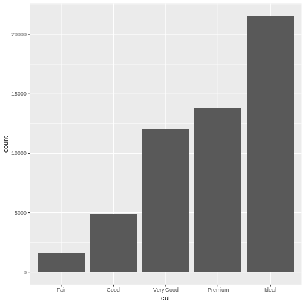

```r
library(knitr)
library(tidyverse)
knitr::opts_chunk$set(echo=TRUE,warning=FALSE,message=FALSE)
```
# tidyverse
From this book R for Data Science, you will be able to learn how to clean, manage, and visualize data which are all necessary for data science. Along with these basic skills, you will be able to learn how to reproduce research, literate programming and save time, which will be a great asset for you asa researcher. 

## Introduction
Everything begin with importing and tidying a data. Tidying data means create data with colums and rows which could be analyzed. Next step will be transforming. Transforming data is basically to subset observations, create new variables, and summarize (ex. means, sum). Data tidying and transforming are called together as data wrangling. 

## Data visualization
### ggplot
Here introduce simple ggplot method to efficiently plot data. There is often a situation when you want to plot multiple gemetory within one canvas. You can shorten your code like code 2 instead of literating the same argument like code 1. In addition, you can specify argument for each geometry like code 3 and 4. You can see that it is even possible to show only a part of data by filtering in code 4.


```r
# 1
ggplot(mpg) +
	geom_point(aes(x=displ,y=hwy))+
	geom_smooth(aes(x=displ,y=hwy))
```


```r
# 2.
ggplot(mpg, aes(x=displ,y=hwy)) +
	geom_point()+
	geom_smooth()
```


```r
# 3.
ggplot(mpg, aes(x=displ,y=hwy)) +
	geom_point(aes(color=class))+
	geom_smooth()
```


```r
# 4.
ggplot(mpg, aes(x=displ,y=hwy)) +
	geom_point(aes(color=class))+
	geom_smooth(data = filter(mpg, class == "subcompact"), se = FALSE)
```


## Data transformation
### dplyr
Once you have data imported, you want to visualize to grasp basic characteristics as well as certain associations of your interest. Data visualization will be easily and effectively done by gglot. However, you need to transform your data to visualize, i.e. create new variables, change type of variables, summarize by group, etc. Here dplyr is a powerful package to transform data in your desired format. 

### dplyr::filter
One of the most basic function in dplyr is filter(). It will basically subset dataset for your interest. A confusing part which a first-time user face is how to write conditional statement, i.e. "and", "or", "not". You have to be careful for writing this statement not as same as english language grammar. The code below is filtering data of flights departed in either November or December. Although you might be tempted to write as: nov_dev <- filter(flights, month == 11 | 12, it won't work. You need to write either: month ==11| month==12, or month %in% c(11,12), like code below.

```r
library(nycflights13)
nov_dec <- filter(flights, month %in% c(11, 12))
```
What you should remember when you use filter is handling of missing value. Filter by default exculdes NA and FALSE value based on the conditional statement you write. Therefore, if you want to keep NA (=missing), you should explicitly write it out.

```r
filter(flights, is.na(month) | month %in% c(11,12))
```

```
## # A tibble: 55,403 x 19
##     year month   day dep_time sched_dep_time dep_delay arr_time
##    <int> <int> <int>    <int>          <int>     <dbl>    <int>
##  1  2013    11     1        5           2359         6      352
##  2  2013    11     1       35           2250       105      123
##  3  2013    11     1      455            500        -5      641
##  4  2013    11     1      539            545        -6      856
##  5  2013    11     1      542            545        -3      831
##  6  2013    11     1      549            600       -11      912
##  7  2013    11     1      550            600       -10      705
##  8  2013    11     1      554            600        -6      659
##  9  2013    11     1      554            600        -6      826
## 10  2013    11     1      554            600        -6      749
## # … with 55,393 more rows, and 12 more variables: sched_arr_time <int>,
## #   arr_delay <dbl>, carrier <chr>, flight <int>, tailnum <chr>,
## #   origin <chr>, dest <chr>, air_time <dbl>, distance <dbl>, hour <dbl>,
## #   minute <dbl>, time_hour <dttm>
```

### dplyr::select
Select is used to keep certain columns of your interest. You can also move a certain columns to the start of the dataframe. 


```r
select(flights, year, month, day)
```

```
## # A tibble: 336,776 x 3
##     year month   day
##    <int> <int> <int>
##  1  2013     1     1
##  2  2013     1     1
##  3  2013     1     1
##  4  2013     1     1
##  5  2013     1     1
##  6  2013     1     1
##  7  2013     1     1
##  8  2013     1     1
##  9  2013     1     1
## 10  2013     1     1
## # … with 336,766 more rows
```

```r
select(flights, year:day)
```

```
## # A tibble: 336,776 x 3
##     year month   day
##    <int> <int> <int>
##  1  2013     1     1
##  2  2013     1     1
##  3  2013     1     1
##  4  2013     1     1
##  5  2013     1     1
##  6  2013     1     1
##  7  2013     1     1
##  8  2013     1     1
##  9  2013     1     1
## 10  2013     1     1
## # … with 336,766 more rows
```

```r
select(flights, -(year:day))
```

```
## # A tibble: 336,776 x 16
##    dep_time sched_dep_time dep_delay arr_time sched_arr_time arr_delay
##       <int>          <int>     <dbl>    <int>          <int>     <dbl>
##  1      517            515         2      830            819        11
##  2      533            529         4      850            830        20
##  3      542            540         2      923            850        33
##  4      544            545        -1     1004           1022       -18
##  5      554            600        -6      812            837       -25
##  6      554            558        -4      740            728        12
##  7      555            600        -5      913            854        19
##  8      557            600        -3      709            723       -14
##  9      557            600        -3      838            846        -8
## 10      558            600        -2      753            745         8
## # … with 336,766 more rows, and 10 more variables: carrier <chr>,
## #   flight <int>, tailnum <chr>, origin <chr>, dest <chr>, air_time <dbl>,
## #   distance <dbl>, hour <dbl>, minute <dbl>, time_hour <dttm>
```
You can efficiently select colums by some functions within select().

* starts_with("abc"): matches names that begin with “abc”.  
* ends_with("xyz"): matches names that end with “xyz”.  

* contains("ijk"): matches names that contain “ijk”.

* matches("(.)\\1"): selects variables that match a regular expression.  

* num_range("x", 1:3): matches x1, x2 and x3.  

When you want to rename variable, you can use rename(). When you want to change the order of the columns (variables), you can use everything() within select(). The code below move two columns "time_hour" and "air_time" to the start of the data.

```r
rename(flights, tail_num = tailnum)
```

```
## # A tibble: 336,776 x 19
##     year month   day dep_time sched_dep_time dep_delay arr_time
##    <int> <int> <int>    <int>          <int>     <dbl>    <int>
##  1  2013     1     1      517            515         2      830
##  2  2013     1     1      533            529         4      850
##  3  2013     1     1      542            540         2      923
##  4  2013     1     1      544            545        -1     1004
##  5  2013     1     1      554            600        -6      812
##  6  2013     1     1      554            558        -4      740
##  7  2013     1     1      555            600        -5      913
##  8  2013     1     1      557            600        -3      709
##  9  2013     1     1      557            600        -3      838
## 10  2013     1     1      558            600        -2      753
## # … with 336,766 more rows, and 12 more variables: sched_arr_time <int>,
## #   arr_delay <dbl>, carrier <chr>, flight <int>, tail_num <chr>,
## #   origin <chr>, dest <chr>, air_time <dbl>, distance <dbl>, hour <dbl>,
## #   minute <dbl>, time_hour <dttm>
```

```r
select(flights, time_hour, air_time, everything())
```

```
## # A tibble: 336,776 x 19
##    time_hour           air_time  year month   day dep_time sched_dep_time
##    <dttm>                 <dbl> <int> <int> <int>    <int>          <int>
##  1 2013-01-01 05:00:00      227  2013     1     1      517            515
##  2 2013-01-01 05:00:00      227  2013     1     1      533            529
##  3 2013-01-01 05:00:00      160  2013     1     1      542            540
##  4 2013-01-01 05:00:00      183  2013     1     1      544            545
##  5 2013-01-01 06:00:00      116  2013     1     1      554            600
##  6 2013-01-01 05:00:00      150  2013     1     1      554            558
##  7 2013-01-01 06:00:00      158  2013     1     1      555            600
##  8 2013-01-01 06:00:00       53  2013     1     1      557            600
##  9 2013-01-01 06:00:00      140  2013     1     1      557            600
## 10 2013-01-01 06:00:00      138  2013     1     1      558            600
## # … with 336,766 more rows, and 12 more variables: dep_delay <dbl>,
## #   arr_time <int>, sched_arr_time <int>, arr_delay <dbl>, carrier <chr>,
## #   flight <int>, tailnum <chr>, origin <chr>, dest <chr>, distance <dbl>,
## #   hour <dbl>, minute <dbl>
```

### dplyr::mutate
Besides selecting columns, there is mutate function which add new columns (variables) at the end of data (code 1). In the same code block, you can immediately refer the column just created (code 2). If you only keep new variables created, you can use transmute instead of mutate like code 3.


```r
# 1
flights_sml <- select(flights, 
  year:day, 
  ends_with("delay"), 
  distance, 
  air_time
)
names(flights_sml)
```

```
## [1] "year"      "month"     "day"       "dep_delay" "arr_delay" "distance" 
## [7] "air_time"
```

```r
mutate(flights_sml,
  gain = dep_delay - arr_delay,
  speed = distance / air_time * 60
)
```

```
## # A tibble: 336,776 x 9
##     year month   day dep_delay arr_delay distance air_time  gain speed
##    <int> <int> <int>     <dbl>     <dbl>    <dbl>    <dbl> <dbl> <dbl>
##  1  2013     1     1         2        11     1400      227    -9  370.
##  2  2013     1     1         4        20     1416      227   -16  374.
##  3  2013     1     1         2        33     1089      160   -31  408.
##  4  2013     1     1        -1       -18     1576      183    17  517.
##  5  2013     1     1        -6       -25      762      116    19  394.
##  6  2013     1     1        -4        12      719      150   -16  288.
##  7  2013     1     1        -5        19     1065      158   -24  404.
##  8  2013     1     1        -3       -14      229       53    11  259.
##  9  2013     1     1        -3        -8      944      140     5  405.
## 10  2013     1     1        -2         8      733      138   -10  319.
## # … with 336,766 more rows
```

```r
# 2 
mutate(flights_sml,
  gain = dep_delay - arr_delay,
  hours = air_time / 60,
  gain_per_hour = gain / hours
)
```

```
## # A tibble: 336,776 x 10
##     year month   day dep_delay arr_delay distance air_time  gain hours
##    <int> <int> <int>     <dbl>     <dbl>    <dbl>    <dbl> <dbl> <dbl>
##  1  2013     1     1         2        11     1400      227    -9 3.78 
##  2  2013     1     1         4        20     1416      227   -16 3.78 
##  3  2013     1     1         2        33     1089      160   -31 2.67 
##  4  2013     1     1        -1       -18     1576      183    17 3.05 
##  5  2013     1     1        -6       -25      762      116    19 1.93 
##  6  2013     1     1        -4        12      719      150   -16 2.5  
##  7  2013     1     1        -5        19     1065      158   -24 2.63 
##  8  2013     1     1        -3       -14      229       53    11 0.883
##  9  2013     1     1        -3        -8      944      140     5 2.33 
## 10  2013     1     1        -2         8      733      138   -10 2.3  
## # … with 336,766 more rows, and 1 more variable: gain_per_hour <dbl>
```

```r
# 3
transmute(flights,
  gain = dep_delay - arr_delay,
  hours = air_time / 60,
  gain_per_hour = gain / hours
)
```

```
## # A tibble: 336,776 x 3
##     gain hours gain_per_hour
##    <dbl> <dbl>         <dbl>
##  1    -9 3.78          -2.38
##  2   -16 3.78          -4.23
##  3   -31 2.67         -11.6 
##  4    17 3.05           5.57
##  5    19 1.93           9.83
##  6   -16 2.5           -6.4 
##  7   -24 2.63          -9.11
##  8    11 0.883         12.5 
##  9     5 2.33           2.14
## 10   -10 2.3           -4.35
## # … with 336,766 more rows
```

### dplyr::summarise
Summarise function is very useful to summarise data for desired output. Summarise itself will not beuseful unless group_by argment is stated together. Code 1 below is simply summarise the mean of depature delay time while code 2 summarise the mean of depature delay time by date, which is probably more informatic. 

```r
# 1
summarise(flights, delay = mean(dep_delay, na.rm = TRUE))
```

```
## # A tibble: 1 x 1
##   delay
##   <dbl>
## 1  12.6
```

```r
# 2
by_day <- group_by(flights, year, month, day)
summarise(by_day, delay = mean(dep_delay, na.rm = TRUE))
```

```
## # A tibble: 365 x 4
## # Groups:   year, month [12]
##     year month   day delay
##    <int> <int> <int> <dbl>
##  1  2013     1     1 11.5 
##  2  2013     1     2 13.9 
##  3  2013     1     3 11.0 
##  4  2013     1     4  8.95
##  5  2013     1     5  5.73
##  6  2013     1     6  7.15
##  7  2013     1     7  5.42
##  8  2013     1     8  2.55
##  9  2013     1     9  2.28
## 10  2013     1    10  2.84
## # … with 355 more rows
```
The code 1 transforms data and visualize by ggplot. First block of code include summarise function basically try to create date of mean distance and mean dely time by destinations. It also subset data only with less noisy ones, i.e. excluding the data with small number of flights and whose destination is Honolulu. Then visualizing the created (aggregated) data by ggplot. There is no problem in code 1 except the necessity of keeping up with intermidiate data till the final data created. Pipe locator is one of the most powerful tool discovered in dplyr which make the code more efficient and clean. All the code blocks in 1 can be re-written like code 2. What you should be careful is that delay in code 2 will be the output of ggplot instead of transformed data. If you want to keep data for further analysis, it is not wise to piping with transforming code block and ggplot code block. If transforming data is only for temporary i.e. only for one-time visualization, it is more efficient to piping transforming part (dplyr) and visualization part (ggplot). There is a possibility to transform data in ggplot code block, it is always better to use dplyr and pipe it to ggplot. 


```r
# 1
by_dest <- group_by(flights, dest)
head(by_dest)
```

```
## # A tibble: 6 x 19
## # Groups:   dest [5]
##    year month   day dep_time sched_dep_time dep_delay arr_time
##   <int> <int> <int>    <int>          <int>     <dbl>    <int>
## 1  2013     1     1      517            515         2      830
## 2  2013     1     1      533            529         4      850
## 3  2013     1     1      542            540         2      923
## 4  2013     1     1      544            545        -1     1004
## 5  2013     1     1      554            600        -6      812
## 6  2013     1     1      554            558        -4      740
## # … with 12 more variables: sched_arr_time <int>, arr_delay <dbl>,
## #   carrier <chr>, flight <int>, tailnum <chr>, origin <chr>, dest <chr>,
## #   air_time <dbl>, distance <dbl>, hour <dbl>, minute <dbl>,
## #   time_hour <dttm>
```

```r
delay <- summarise(by_dest,
  count = n(),
  dist = mean(distance, na.rm = TRUE),
  delay = mean(arr_delay, na.rm = TRUE)
)
delay <- filter(delay, count > 20, dest != "HNL")
# It looks like delays increase with distance up to ~750 miles and then decrease. Maybe as flights get longer there's more ability to make up delays in the air?
ggplot(data = delay, mapping = aes(x = dist, y = delay)) +
  geom_point(aes(size = count), alpha = 1/3) +
  geom_smooth(se = FALSE)
```


```r
# 2
delay <- flights %>%
       	group_by(dest) %>%
	summarise(
		  count = n(),
		  dist = mean(distance, na.rm = TRUE),
		  delay = mean(arr_delay, na.rm = TRUE)) %>%
	filter(count > 20, dest != "HNL") %>%
	ggplot(mapping = aes(x = dist, y = delay)) +
	geom_point(aes(size = count), alpha = 1/3) +
        geom_smooth(se = FALSE)
```

By using conditonal sentence within summarise argument, it will enable to count the number of observation by group which meet the conditions. This will be done by sum() to simply count the number of observations which meet the condition, and mean() can produce the propotion against the total observation within the group that meet the condition.


```r
# 1
flights %>%
	#filter(!is.na(dep_time)) %>%
        group_by(year, month, day) %>% 
        summarise(n_early = sum(dep_time < 500, na.rm=TRUE))
```

```
## # A tibble: 365 x 4
## # Groups:   year, month [12]
##     year month   day n_early
##    <int> <int> <int>   <int>
##  1  2013     1     1       0
##  2  2013     1     2       3
##  3  2013     1     3       4
##  4  2013     1     4       3
##  5  2013     1     5       3
##  6  2013     1     6       2
##  7  2013     1     7       2
##  8  2013     1     8       1
##  9  2013     1     9       3
## 10  2013     1    10       3
## # … with 355 more rows
```

```r
# 2
flights %>%
	filter(!is.na(dep_time)) %>%
        group_by(year, month, day) %>% 
        summarise(n_early = mean(dep_time < 500))
```

```
## # A tibble: 365 x 4
## # Groups:   year, month [12]
##     year month   day n_early
##    <int> <int> <int>   <dbl>
##  1  2013     1     1 0      
##  2  2013     1     2 0.00321
##  3  2013     1     3 0.00442
##  4  2013     1     4 0.00330
##  5  2013     1     5 0.00418
##  6  2013     1     6 0.00241
##  7  2013     1     7 0.00215
##  8  2013     1     8 0.00112
##  9  2013     1     9 0.00334
## 10  2013     1    10 0.00323
## # … with 355 more rows
```

```r
### this is for kosha visualization data
# chronic_prop  <- kosha_vis %>%
#	group_by(year, Kyuson, gender, age_cat) %>%
#	summarise(hbp_prop = mean(hbp_ob==1, na.rm = TRUE)) %>%
#	summarise(diab_prop1 = mean(diab_ob1==1, na.rm = TRUE)) %>%
#	summarise(diab_prop2 = mean(diab_ob2==1, na.rm = TRUE)) %>%
#	summarise(dyslip_prop = mean(dyslip_ob==1, na.rm = TRUE)) %>%
#	summarise(obese_prop = mean(obesity==1, na.rm = TRUE))
```

## Exploratory data analysis
EDA in short is the starting point of data analysis, which include data transformation and visualization. First step of EDA is to visualize data based on the type of variables within the data. When variable is categorical, first thing you want to do is to visualize the frequency by categories. This will be done by bar chart like code 1. When variable is continuous, you want to visualize the distribution and it is done by histogram like code 2. 


```r
# 1
ggplot(data = diamonds) +
  geom_bar(mapping = aes(x = cut))
```



```r
# 2
ggplot(data = diamonds) +
  geom_histogram(mapping = aes(x = carat), binwidth=0.5)
```


Next step is to explore the distribution of varialbes deeper. It is often interesting to see the distribution by groups like code below. Code 1 and 2 are both visualizing the distribution of carat of diamonds by group:cut, but in different way, i.e. bar vs line. As you notice, it would be much easier to see with line when distribution plot is overlapped each other.


```r
# 1
ggplot(data = diamonds, mapping = aes(x = carat, color = cut)) +
  geom_histogram(binwidth=0.5)
```


```r
# 2
ggplot(data = diamonds, mapping = aes(x = carat, color = cut)) +
  geom_freqpoly()
```


Why is it important to visualize distribution of single variable? Although most peole neglect the importance of simple histrogram, there is often a situation that you can find interensting feature, ex. clustering. From code 1 and 2 below, you can notice there is a clustering, i.e. there there are multiple points which have high frequency. This often lead you to develop questions, what other variable in the data might explain this clustering (=tendency)?


```r
# 1
ggplot(data = diamonds, mapping = aes(x = carat)) +
  geom_histogram(binwidth=0.01)
```


```r
# 2
ggplot(data = faithful, mapping = aes(x = eruptions)) + 
  geom_histogram(binwidth = 0.25)
```


Next important step is to investigate outliers. In most cases, data contains outliers due to data entry error or measurament error. If you try to visualize outliers of continuous variables by histogram, you may not be able to see it when data is too large and variable's value can be very large. In that case you can add an argument "coord_cartesian" to limit y axis.


```r
ggplot(diamonds) + 
  geom_histogram(mapping = aes(x = y), binwidth = 0.5) +
  coord_cartesian(ylim = c(0, 50))
```


You always need to make a decision whether you include outliers in the analysis. If outliers do not have significant effect on your results, you can handle them as missing and move on. However, if it has significant effect on your results, you should not drop them without justification. You need to figure out what caused them, i.e. data entry, measurament errors, and explain why and how you remove outliers. 

Besides outliers, there are often missing values. These are usually not visualized in ggplot by default. However, warning/messages might appear. You can hide such messeges by adding "na.rm=TRUE" within ggplot code block.

```r
#ggplot(data = diamonds2, mapping = aes(x = x, y = y)) + 
#  geom_point(na.rm = TRUE)
```


## Tibble
Tibbles are data frames, but they tweak some older behaviors to make life little easier. 

## Data import
Importing data is initial step for all analysis. Data to import is ideally in clean format, i.e. with column names in the first rows and values within each column. However, there are often cases that first few rows are filled with metadata or columns names are not analysis-friendy (including special character, space, non-alphabet, etc.). There are a few technics that readr package can handle such data to import efficiently. Code 1 is reading csv data by skipping first 2 rows. Code 2 is reading csv data by deleting the comment specified in the argument. Code 3 is reading csv file which does not have column names, so "col_names = FALSE" prevents from reading the first row of data as column names. Code 4 is reading csv file with specifying column names as x,y, and z.


```r
# 1
read_csv("The first line of metadata
  The second line of metadata
  x,y,z
  1,2,3", skip = 2)
```

```
## # A tibble: 1 x 3
##       x     y     z
##   <dbl> <dbl> <dbl>
## 1     1     2     3
```

```r
# 2
read_csv("# a comment want to be deleted
	 x, y, z
	 1, 2, 3", comment = "#")
```

```
## # A tibble: 1 x 3
##       x     y     z
##   <dbl> <dbl> <dbl>
## 1     1     2     3
```

```r
# 3
read_csv("1,2,3\n4,5,6", col_names = FALSE)
```

```
## # A tibble: 2 x 3
##      X1    X2    X3
##   <dbl> <dbl> <dbl>
## 1     1     2     3
## 2     4     5     6
```

```r
# 4 
read_csv("1,2,3\n4,5,6", col_names = c("x","y","z"))
```

```
## # A tibble: 2 x 3
##       x     y     z
##   <dbl> <dbl> <dbl>
## 1     1     2     3
## 2     4     5     6
```

### Parsing 
Parsing is one of the powerful function within readr. When you want to extract numeric part of data, parse will effectivly conduct the job when importing data. 

```r
parse_number("$100")
```

```
## [1] 100
```

```r
#> [1] 100
parse_number("20%")
```

```
## [1] 20
```

```r
#> [1] 20
parse_number("It cost $123.45")
```

```
## [1] 123.45
```

```r
#> [1] 123
```


## Relational data
### Key
When you working on data, you will mostly encounter more than one data to explore your interest. Merging is a traditional function that will merge data with key variable. However, using join function within tidyverse is more poweful and efficent when you work with relational data. It is always important to remember that there are primary keys and foreign keys in datasets which will identify unique obsavation, and start with verifying which one varieble is a key. You can explore whether a certain variable is primary key or not by counting the number of unique observation. Code 1 is attempting to identfy primary key by counting the number of unique observation of suspected variable. You can see that carrier is not primary key of flights dataset as it has many observasions for each value whereas tailnum is a primay key for planes as there is no more than 1 observation with unique tailnum. There is a case when you cannot find primary key even with combination of variables. For instance, in flights dataset, neither combination of year, day, hour, and tailnum, and year, day, hour, and flight are key to identify unique observation (Code 2).


```r
# 1
flights %>%
	count(carrier) %>%
	filter(n > 1)
```

```
## # A tibble: 16 x 2
##    carrier     n
##    <chr>   <int>
##  1 9E      18460
##  2 AA      32729
##  3 AS        714
##  4 B6      54635
##  5 DL      48110
##  6 EV      54173
##  7 F9        685
##  8 FL       3260
##  9 HA        342
## 10 MQ      26397
## 11 OO         32
## 12 UA      58665
## 13 US      20536
## 14 VX       5162
## 15 WN      12275
## 16 YV        601
```

```r
planes %>%
	count(tailnum) %>%
	filter(n > 1)
```

```
## # A tibble: 0 x 2
## # … with 2 variables: tailnum <chr>, n <int>
```

```r
# 2
flights %>%
	count(year, day, hour, tailnum) %>%
	filter(n > 1)
```

```
## # A tibble: 46,930 x 5
##     year   day  hour tailnum     n
##    <int> <int> <dbl> <chr>   <int>
##  1  2013     1     5 N197UW      2
##  2  2013     1     5 N24211      2
##  3  2013     1     5 N538UW      2
##  4  2013     1     5 N708JB      2
##  5  2013     1     5 N76517      2
##  6  2013     1     6 N10156      2
##  7  2013     1     6 N103US      2
##  8  2013     1     6 N108UW      2
##  9  2013     1     6 N11107      2
## 10  2013     1     6 N11206      2
## # … with 46,920 more rows
```

```r
flights %>%
	count(year, day, hour, flight) %>%
	filter(n > 1)
```

```
## # A tibble: 64,566 x 5
##     year   day  hour flight     n
##    <int> <int> <dbl>  <int> <int>
##  1  2013     1     5    252     2
##  2  2013     1     5    701     5
##  3  2013     1     5    725     5
##  4  2013     1     5    939     5
##  5  2013     1     5   1117     2
##  6  2013     1     5   1141     4
##  7  2013     1     5   1431     2
##  8  2013     1     5   1545     3
##  9  2013     1     5   1714     6
## 10  2013     1     5   1895     2
## # … with 64,556 more rows
```
In the code 2 above, you could not identfy combination of variables as primary key. It seems like both tailnum and flight number are used multiple times within a day. In such cases, it is useful to add new variable with mutate() or row_number(). This is called **surrogate key**.

### Mutating joins
When you know primary and foreign key of multiple data, you can join the data. Code 1 below is doing mutating join, ie.e adding new variable to the right end of the data by key variable. 

```r
# 1
flights2 <- flights %>%
	select(year:day, hour, origin, dest, tailnum, carrier)
flights2 %>%
	select(-origin, -dest) %>%
	left_join(airlines, by = "carrier")
```

```
## # A tibble: 336,776 x 7
##     year month   day  hour tailnum carrier name                    
##    <int> <int> <int> <dbl> <chr>   <chr>   <chr>                   
##  1  2013     1     1     5 N14228  UA      United Air Lines Inc.   
##  2  2013     1     1     5 N24211  UA      United Air Lines Inc.   
##  3  2013     1     1     5 N619AA  AA      American Airlines Inc.  
##  4  2013     1     1     5 N804JB  B6      JetBlue Airways         
##  5  2013     1     1     6 N668DN  DL      Delta Air Lines Inc.    
##  6  2013     1     1     5 N39463  UA      United Air Lines Inc.   
##  7  2013     1     1     6 N516JB  B6      JetBlue Airways         
##  8  2013     1     1     6 N829AS  EV      ExpressJet Airlines Inc.
##  9  2013     1     1     6 N593JB  B6      JetBlue Airways         
## 10  2013     1     1     6 N3ALAA  AA      American Airlines Inc.  
## # … with 336,766 more rows
```

```r
#view(flights2)
```
There are 2 types of joins: inner join and outer join. An inner join keeps observations that appear in both tables. An outer join keeps observations that appear in at least one table. There are 3 types of outer joins:
* A left join keeps all observations in x.  
* A right join keeps all observations in y.  
* A full join keeps all observations in x and y. 
Your default join should be left join as it will keep original observations even if there is no match.

### Defining the key columns
There are often cases that key columns that you want to join by between two data are in different name. In such cases, join will be easilly done by specifying each variable name as code 1. 

```r
flights2 %>% 
  left_join(airports, c("dest" = "faa"))
```

```
## # A tibble: 336,776 x 15
##     year month   day  hour origin dest  tailnum carrier name    lat   lon
##    <int> <int> <int> <dbl> <chr>  <chr> <chr>   <chr>   <chr> <dbl> <dbl>
##  1  2013     1     1     5 EWR    IAH   N14228  UA      Geor…  30.0 -95.3
##  2  2013     1     1     5 LGA    IAH   N24211  UA      Geor…  30.0 -95.3
##  3  2013     1     1     5 JFK    MIA   N619AA  AA      Miam…  25.8 -80.3
##  4  2013     1     1     5 JFK    BQN   N804JB  B6      <NA>   NA    NA  
##  5  2013     1     1     6 LGA    ATL   N668DN  DL      Hart…  33.6 -84.4
##  6  2013     1     1     5 EWR    ORD   N39463  UA      Chic…  42.0 -87.9
##  7  2013     1     1     6 EWR    FLL   N516JB  B6      Fort…  26.1 -80.2
##  8  2013     1     1     6 LGA    IAD   N829AS  EV      Wash…  38.9 -77.5
##  9  2013     1     1     6 JFK    MCO   N593JB  B6      Orla…  28.4 -81.3
## 10  2013     1     1     6 LGA    ORD   N3ALAA  AA      Chic…  42.0 -87.9
## # … with 336,766 more rows, and 4 more variables: alt <int>, tz <dbl>,
## #   dst <chr>, tzone <chr>
```

## Strings
When data contain any string values, such as residential addresses, stringr package will be the one to manipulate strings. You need to explicitly load stringr besides tidyverse.There are many useful functions in stringr, all starting with "str..". For example, code 1 is combining two strings. There are other functions such as subsetting a part of string, changing a letter from lower to upper, or vice-versa, we will not cover them here.


```r
# 1
library(stringr)
str_c("x", "y")
```

```
## [1] "xy"
```

```r
str_c("x", "y", "z")
```

```
## [1] "xyz"
```

```r
str_c("x", "y", "z", sep = ", ")
```

```
## [1] "x, y, z"
```
### Regular expression
To learn regular expression, you will use str_view. The following code is the smiplest patterns match. Code 1 is trying to match a part of string "an". Code 2 is trying to match any character next to "a" by using ".".

```r
library(htmlwidgets)
x <- c("apple", "banana", "pear")
# 1
str_view(x, "an")
```

```
## Error in loadNamespace(name): there is no package called 'webshot'
```

```r
# 2
str_view(x, ".a.")
```

```
## Error in loadNamespace(name): there is no package called 'webshot'
```
When you want to match "." within a string, you will use escape to tell the regular expression you want to match it exactly. For escaping, you will use "\\" in the statement. When you want to match with "\" in a string, you will have to type "\\\\".

```r
# To create the regular expression, we need \\
dot <- "\\."

# But the expression itself only contains one:
writeLines(dot)
```

```
## \.
```

```r
#> \.

# And this tells R to look for an explicit .
str_view(c("abc", "a.c", "bef"), "a\\.c")
```

```
## Error in loadNamespace(name): there is no package called 'webshot'
```

```r
x <- "a\\b"
writeLines(x)
```

```
## a\b
```

```r
#> a\b

str_view(x, "\\\\")
```

```
## Error in loadNamespace(name): there is no package called 'webshot'
```
Regular expression will match any part of a string by default. It is useful to anchor regular expressions so that it will match a start or end of a string. 
* "^" to match the start of the string  
* "$" to match the end of the string  
It is easier to remember with: if you begin with power (^), you will end up with money ($).


```r
x <- c("apple", "banana", "pear")
str_view(x, "^a")
```

```
## Error in loadNamespace(name): there is no package called 'webshot'
```

```r
str_view(x, "$a")
```

```
## Error in loadNamespace(name): there is no package called 'webshot'
```
If you want to force  regular expression to match a complete string, you will anchor it with both. 


```r
x <- c("apple pie", "apple", "apple cake")
str_view(x, "apple")
```

```
## Error in loadNamespace(name): there is no package called 'webshot'
```

```r
str_view(x, "^apple$")
```

```
## Error in loadNamespace(name): there is no package called 'webshot'
```

There are other useful tools to match more than one character within a string besides ".". 

* \d: matches any digit.  
* \s: matches any whitespace (e.g. space, tab, newline).  
* [abc]: matches a, b, or c.  
* [^abc]: matches anything except a, b, or c.  

[abc] is useful when you want to find a single metacharacter instead of using escape simbol. However, some characters, such as ], /, ^, and - will not be handled with a character class, so you should be careful.

```r
str_view(c("abc", "a.c", "a*c", "a c"), "a[.]c")
```

```
## Error in loadNamespace(name): there is no package called 'webshot'
```

```r
str_view(c("abc", "a.c", "a*c", "a c"), ".[*]c")
```

```
## Error in loadNamespace(name): there is no package called 'webshot'
```

```r
str_view(c("abc", "a.c", "a*c", "a c"), "a[ ]")
```

```
## Error in loadNamespace(name): there is no package called 'webshot'
```
By using parentheses and |, you can match more than one character within a specified string.

```r
str_view(c("grey", "gray"), "gr(e|a)y")
```

```
## Error in loadNamespace(name): there is no package called 'webshot'
```


